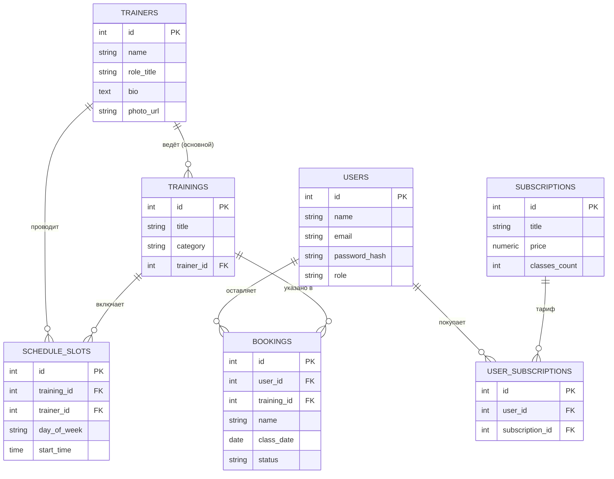

# Selderey Body — сайт фитнес-студии

Учебный проект, реализованный в рамках производственной практики (ТОО «Welon Agency», 25.12.2025–26.02.2026) по календарному плану. Полноценный сайт фитнес-студии «Selderey Body»: статический фронтенд (HTML5/CSS3/JS) + REST API на Node.js/Express + база данных PostgreSQL.

## Стек технологий

Фронтенд: HTML5, CSS3 (CSS-переменные, Grid/Flexbox, медиа-запросы), нативный JavaScript (без фреймворков и сборщиков).
Backend: Node.js, Express, PostgreSQL (`pg`), JWT (`jsonwebtoken`), `bcryptjs`, `express-validator`, `cors`, `morgan`.
Деплой: Vercel (фронтенд), Render (backend + managed PostgreSQL).

## Структура проекта

```
selderey-body/
├── frontend/
│   ├── index.html         главная страница
│   ├── trainings.html     тренировки + расписание (динамическая загрузка из API)
│   ├── trainers.html      тренеры (модальные окна с подробной информацией)
│   ├── prices.html        абонементы
│   ├── contacts.html      контакты + форма онлайн-записи
│   ├── css/styles.css     дизайн-система (бело-зелёная палитра)
│   ├── js/main.js         интерактивность: меню, слайдер, модалки, валидация, scroll-анимации
│   ├── js/api.js          интеграция с backend (fetch, fallback-данные)
│   ├── robots.txt, sitemap.xml, vercel.json
└── backend/
    ├── server.js              точка входа Express-приложения
    ├── src/db.js               подключение к PostgreSQL (пул соединений)
    ├── src/middleware/         JWT-аутентификация, обработка ошибок
    ├── src/routes/             auth, trainers, trainings, schedule, bookings, subscriptions
    ├── sql/schema.sql          DDL базы данных
    ├── sql/seed.sql            тестовые данные (тренеры, направления, расписание, тарифы)
    ├── scripts/runSql.js       применение .sql файлов к базе
    ├── scripts/createAdmin.js  создание администратора с bcrypt-хешем пароля
    ├── postman/                коллекция запросов для тестирования API
    ├── render.yaml, Procfile, .env.example
```

## Схема базы данных (ER-диаграмма)



Подробное описание таблиц — в `backend/sql/schema.sql` (комментарии у каждой таблицы).

## Запуск локально

### 1. База данных
```bash
createdb selderey_body
cd backend
cp .env.example .env       # заполнить DATABASE_URL и JWT_SECRET
npm install
npm run db:schema          # применить sql/schema.sql
npm run db:seed            # наполнить тестовыми данными
npm run create:admin -- "Админ" admin@seldereybody.kz StrongPass123
```

### 2. Backend
```bash
npm run dev                # http://localhost:4000, проверка: GET /api/health
```

### 3. Frontend
Открыть `frontend/index.html` через любой статический сервер (например, VS Code Live Server на порту 5500) — это значение указано по умолчанию в `CLIENT_ORIGIN` backend `.env.example`. Перед деплоем поменять `window.SB_API_BASE` в `frontend/js/api.js` (или задать через `<script>window.SB_API_BASE = "https://ваш-backend.onrender.com/api"</script>` до подключения `api.js`) на адрес продакшен-backend.

## REST API

Базовый префикс: `/api`. Защищённые маршруты требуют заголовок `Authorization: Bearer <token>`, полученный через `/api/auth/login`. Действия создания/изменения/удаления для тренеров, направлений, расписания, тарифов и просмотр всех заявок доступны только роли `admin`.

| Метод | Маршрут | Доступ | Описание |
|---|---|---|---|
| GET | /api/health | публичный | проверка работоспособности |
| POST | /api/auth/register | публичный | регистрация клиента |
| POST | /api/auth/login | публичный | вход, получение JWT |
| GET | /api/auth/me | авторизован | данные текущего пользователя |
| GET | /api/trainers | публичный | список тренеров |
| GET/POST/PUT/DELETE | /api/trainers/:id | admin (кроме GET) | CRUD тренеров |
| GET | /api/trainings | публичный | список направлений (фильтр `?category=`) |
| POST/PUT/DELETE | /api/trainings/:id | admin | CRUD направлений |
| GET | /api/schedule | публичный | расписание (день/время/направление/тренер) |
| POST/PUT/DELETE | /api/schedule/:id | admin | CRUD слотов расписания |
| POST | /api/bookings | публичный | отправка заявки (форма записи) |
| GET/PATCH/DELETE | /api/bookings | admin | просмотр и обработка заявок |
| GET | /api/subscriptions | публичный | список тарифов |
| POST/PUT/DELETE | /api/subscriptions/:id | admin | CRUD тарифов |

Коллекция Postman: `backend/postman/SelnoteyBody.postman_collection.json`.

## Деплой

Frontend → Vercel: импортировать папку `frontend/` как статический проект (конфиг `vercel.json` уже включён).
Backend → Render: создать Web Service из папки `backend/` (или использовать `render.yaml` через Blueprint), подключить managed PostgreSQL, применить `npm run db:schema` и `npm run db:seed` через Render Shell, выставить переменные окружения из `.env.example`.
После деплоя backend обновить `CLIENT_ORIGIN` (CORS) на реальный домен Vercel и `window.SB_API_BASE` на фронтенде — на реальный домен Render.

## Соответствие календарному плану

Неделя 2 — семантическая разметка главной страницы (`index.html`).
Неделя 3 — адаптивная многостраничная вёрстка (`trainings.html`, `trainers.html`, `prices.html`, `contacts.html`).
Неделя 4 — JS-интерактивность (`js/main.js`): меню, слайдер, модальные окна, валидация форм, scroll-анимации, `localStorage`.
Неделя 5 — схема БД PostgreSQL (`sql/schema.sql`, ER-диаграмма выше).
Неделя 6 — REST API на Express с JWT-аутентификацией и CRUD (`src/routes/*`, Postman-коллекция).
Неделя 7 — интеграция фронтенда с API (`js/api.js`, форма записи → `/api/bookings`).
Неделя 8 — оптимизация и SEO (`meta`/Open Graph теги, `loading="lazy"`, `width`/`height`, `robots.txt`, `sitemap.xml`).
Неделя 9 — деплой-конфигурация и документация (`vercel.json`, `render.yaml`, `Procfile`, этот README).

## Примечания

Фотографии тренеров и студии — из альбома, предоставленного заказчиком, отдаются напрямую с Google Photos CDN.
Расписание основано на данных публичного виджета Fitbase студии на момент разработки; цены на абонементы — демонстрационные.
Имена тренеров указаны без фамилий по требованию заказчика.
